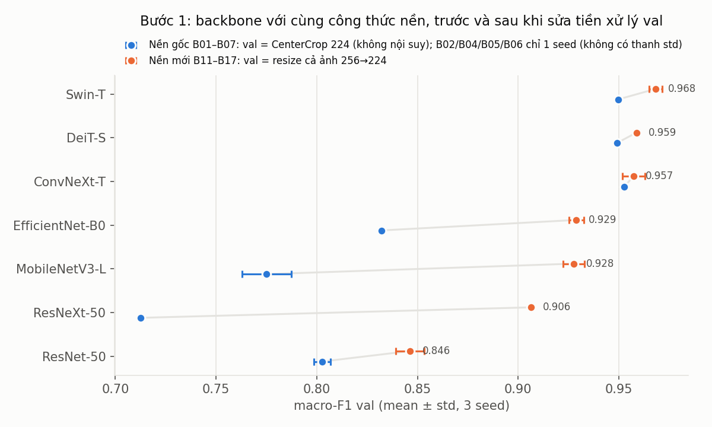
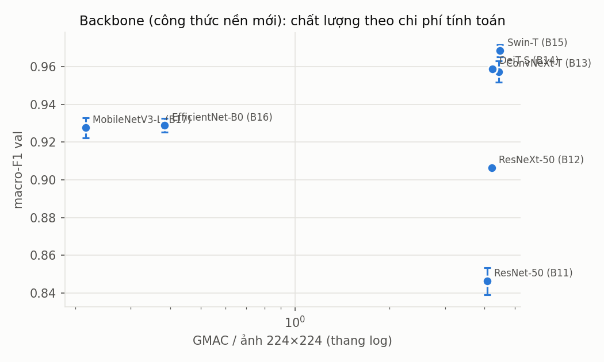
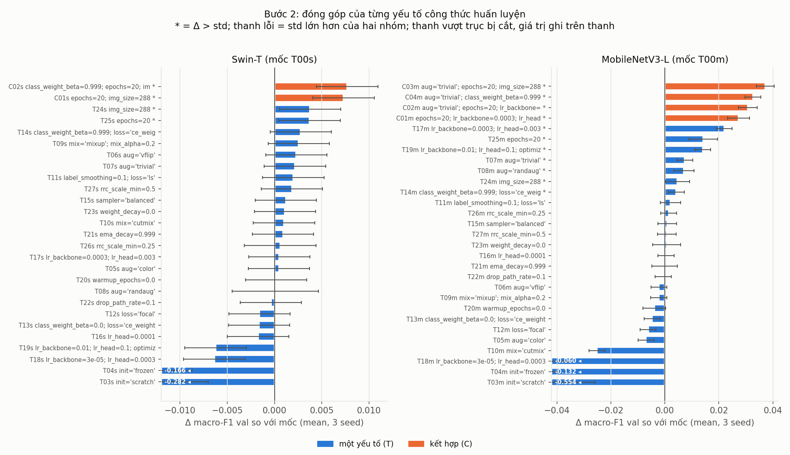
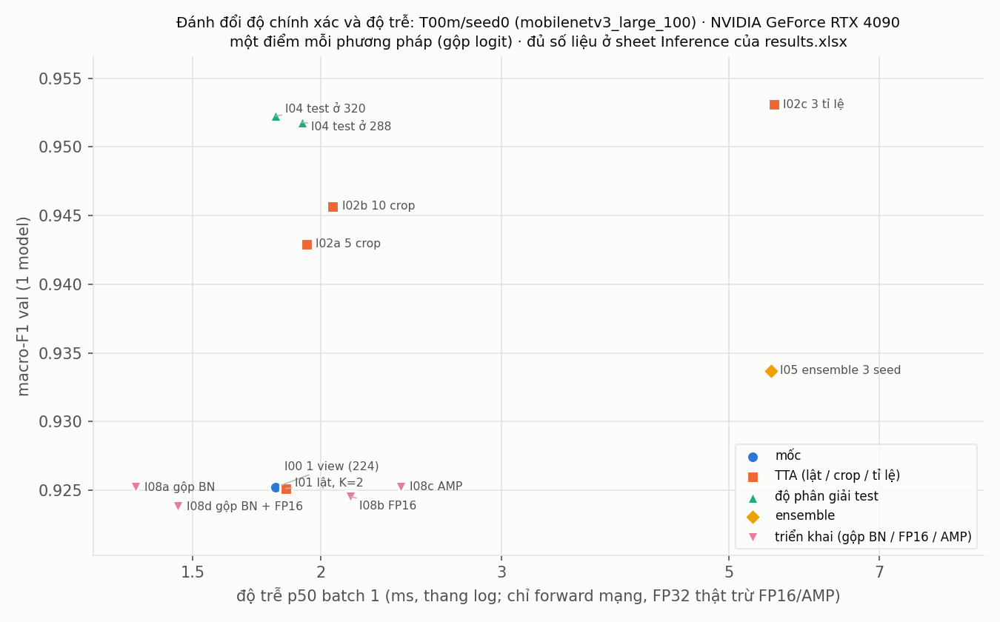
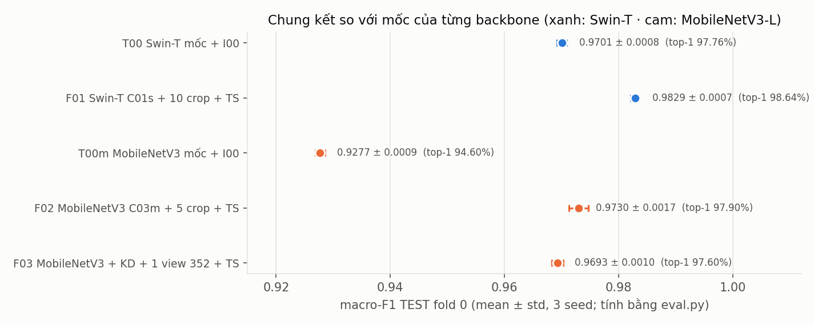
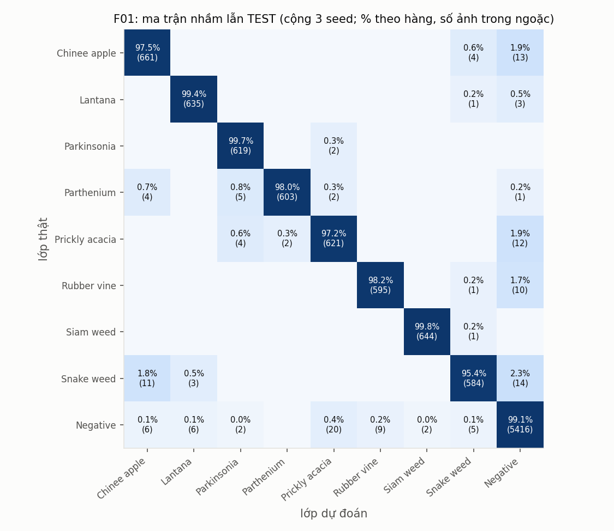

# Báo cáo Lab Day 2: Backbone, công thức huấn luyện và suy luận trên DeepWeeds

**Sinh viên:** Nguyễn Sơn Giang · MSSV 2A202602747 · Track 4, Ngày 2
**Bảng số liệu đầy đủ:** [`results.xlsx`](results.xlsx) · **Điểm chấm tự động:** [`eval/`](eval) · **Code:** [`code/`](code)

Mọi con số dưới đây đến từ lần chạy thật, truy ngược được tới một `exp_id` (thư mục `runs/<exp_id>/seed<k>/`, ảnh `curves/<exp_id>_*.png`). Số trên test do `eval.py` của repo gốc tính từ `predictions/`. Quy ước: "val" là `val_subset0.csv`, "test" là `test_subset0.csv`; mean ± std qua 3 seed, std mẫu `ddof=1`.

---

## 1. Tóm tắt

- **Bài toán:** phân loại 9 lớp cỏ dại DeepWeeds (fold 0, dữ liệu mất cân bằng: `Negative` chiếm 52%). Chỉ số chính là macro-F1.
- **Đã làm:** 7 backbone (+ DINOv2), 2 lần, trước và sau khi sửa tiền xử lý val. 26 thí nghiệm công thức huấn luyện × 2 backbone × 3 seed, phủ 7 trục A–G. 6 cấu hình kết hợp. 9 phương pháp suy luận kèm đo độ trễ. Chưng cất tri thức, lệch phân phối và thích ứng lúc test, Grad-CAM, ONNX. Tổng cộng 86 thí nghiệm huấn luyện, khoảng 290 lần chạy.
- **Cấu hình tốt nhất (F01):** Swin-T, train ở 288 trong 20 epoch, suy luận 10 crop gộp logit, có temperature scaling. Trên **test**: macro-F1 **0,9829 ± 0,0007**, top-1 **98,64 ± 0,07%**. Mốc của chính bài là T00 + I00 (0,9701 ± 0,0008), nên chênh lệch là **+0,0128**, khoảng 16 lần std. Recall Chinee apple 97,5%, Snake weed 95,4%; bài báo gốc đạt 88,5% và 88,8%.
- **Cấu hình thời gian thực (F03):** MobileNetV3-L có KD từ Swin, 1 view ở 352. Test macro-F1 **0,9693 ± 0,0010**, top-1 97,60%. Độ trễ p95 ở batch 1 là **4,35 ms** (RTX 3090, FP32), còn 3,47 ms nếu gộp BN.
- **Kết luận chính:**
  1. Phát hiện lớn nhất của bài là một **lỗi tiền xử lý val**. Với ảnh gốc 256×256, "Resize 256 + CenterCrop 224" trả về ảnh **không qua nội suy**, trong khi ảnh train luôn bị `RandomResizedCrop` nội suy. Chỉ riêng chênh lệch độ sắc nét này làm macro-F1 val của các mạng BatchNorm thấp đi tới 0,19.
  2. Sau khi sửa lỗi đó, thứ tự đóng góp vào kết quả là: backbone > công thức huấn luyện > suy luận.
  3. Không có kỹ thuật nào giúp được mọi mạng. Swin-T gần như miễn nhiễm với công thức, trong khi MobileNetV3 được +0,037 macro-F1 val chỉ nhờ công thức.

## 2. Dữ liệu và thiết lập

### 2.1 Kiểm tra chia dữ liệu (README mục 2.1)

Script: `code/eda.py`, số liệu trong `eda_split_check.json`.

| | train | val | test | tổng | Table 1 bài báo |
|---|---|---|---|---|---|
| Số ảnh | 10.501 (59,97%) | 3.501 (20,00%) | 3.507 (20,03%) | 17.509 | 17.509 |
| Chinee apple | 675 | 225 | 226 | **1.126** | 1.125 |
| Lantana | 637 | 213 | 213 | **1.063** | 1.064 |
| Parkinsonia / Parthenium / Prickly acacia | 618 / 613 / 637 | 206 / 204 / 212 | 207 / 205 / 213 | 1.031 / 1.022 / 1.062 | khớp |
| Rubber vine / Siam weed / Snake weed | 605 / 644 / 609 | 202 / 215 / 203 | 202 / 215 / 204 | 1.009 / 1.074 / 1.016 | khớp |
| Negative | 5.463 | 1.821 | 1.822 | 9.106 | 9.106 |

- Giao theo tên file của train∩val, train∩test và val∩test đều **rỗng**. Hợp ba tập đúng **17.509** ảnh, và mọi file đều có trên đĩa.
- Tỉ lệ lớp lớn nhất so với lớp nhỏ nhất là **9,02** (Negative so với Rubber vine).
- **Hai lỗi nhỏ trong dữ liệu gốc** (ghi lại, không sửa CSV, theo quy tắc S1):
  1. File fold chỉ có cột `Filename, Label`. README mô tả thêm cột `Species` nhưng file thật không có.
  2. Ảnh `20170714-110407-3.jpg` được mọi fold ghi là Chinee apple (0), nhưng `labels.csv` ghi là Lantana (1). Chính ảnh này tạo ra độ lệch ±1 so với Table 1. Ảnh nằm trong train của fold 0 nên không ảnh hưởng val/test. Ảnh: `figures/eda_label_mismatch.png`.
- Phân bố lớp ở `figures/eda_class_distribution.png`, ảnh mẫu (4 ảnh mỗi lớp) ở `figures/eda_samples.png`.
- Thống kê pixel trên 500 ảnh train: mọi ảnh 256×256 RGB; mean (0,336; 0,350; 0,341), std (0,229; 0,229; 0,226). Bài vẫn dùng mean/std ImageNet cho khớp với trọng số tiền huấn luyện.
- **Nhận xét bằng mắt:** Chinee apple và Snake weed đều là cây lá rộng, xanh đậm, mọc thành bụi, nên dễ nhầm. `Negative` rất đa dạng (cỏ, dương xỉ, đất trống), là "lớp rác".

### 2.2 Kiểm tra pipeline trước khi chạy thật (GUIDE mục 1.3)

Script: `code/sanity.py`, số liệu trong `sanity.json`. Unit test: `code/test_code.py`, 22 test đều đạt.

- **Loss ban đầu** (head mới, chưa train, 1 batch val) của 7 backbone nằm trong khoảng **2,194–2,256**, sát ln 9 = 2,197.
  - Để có được điều này, head của mọi backbone được khởi tạo lại giống nhau: N(0; 0,01), bias = 0.
  - Nếu giữ mặc định của timm, EfficientNet/MobileNet (khởi tạo kiểu Google) cho loss ban đầu khoảng 4,3.
- **Overfit 16 ảnh** (ResNet-50, 150 bước): loss giảm 2,196 → 0,00008, accuracy ở chế độ eval 100%. Đồ thị: `figures/sanity_overfit_batch.png`.
- **Ảnh sau augmentation** (đã giải chuẩn hoá) kèm nhãn, cho mọi mức aug và cho CutMix/Mixup: `figures/sanity_*.png`. Đã kiểm tra bằng mắt rằng ảnh và nhãn khớp nhau.
- **`model.eval()`:** cùng một ảnh cho logit gần như giống hệt dù chạy trong batch 1 ảnh hay batch 64 ảnh (lệch < 1,4e-4), tức BN dùng running stats.
- **Unit test cho các phần dễ sai:**
  - focal loss với γ = 0 bằng CE (sai số < 1e-6); label smoothing với ε = 0 bằng CE;
  - λ của CutMix bằng đúng diện tích dán thực;
  - weight decay = 0 cho norm/bias;
  - đóng băng backbone thì BN đứng yên và head vẫn train;
  - lịch warmup + cosine; EMA; KD loss;
  - gộp BN không đổi logit (< 1e-3) trên ResNet, EfficientNet, MobileNetV3;
  - temperature scaling khôi phục đúng T = 2,5 trên dữ liệu giả.

### 2.3 Công thức nền T00 và môi trường

| Thành phần | Giá trị |
|---|---|
| Khởi tạo | Trọng số ImageNet-1k của timm (tag ghi trong `results.xlsx`), head 9 lớp mới N(0; 0,01), tinh chỉnh toàn bộ |
| Train | `RandomResizedCrop(224, scale=(0,08; 1))` + lật ngang, chuẩn hoá ImageNet |
| Val/test | **Resize cả ảnh 256 → 224** (`crop_pct = 1,0`), xem mục 3.1 |
| Tối ưu | AdamW; LR backbone 1e-4, head 1e-3; weight decay 0,05 (không áp cho norm/bias/token); warmup 1 epoch rồi cosine về 0, cập nhật theo bước |
| Loss, batch, epoch | CE; batch 64 (`drop_last`); 12 epoch; AMP FP16; `channels_last` |
| Chọn checkpoint | Epoch có macro-F1 val cao nhất (hoà thì lấy epoch sớm hơn), tính bằng `eval.compute_metrics` |
| Seed | `random`, `numpy`, `torch`, seed riêng cho từng worker DataLoader. `cudnn.benchmark = True` nên không bảo đảm giống từng bit |
| Phần cứng | SLURM `gpus24`: RTX 3090 / RTX 4090 (24 GB), 12 lõi CPU. Mỗi số đo độ trễ ghi kèm tên GPU |
| Thư viện | Python 3.10.19, torch 2.6.0+cu124, torchvision 0.21.0, timm 1.0.15, numpy 1.26.4 (`requirements.txt`) |

Mọi thí nghiệm đi qua **một** hàm `train.run(Config)` (`code/train.py`); danh sách thí nghiệm khai báo trong `code/run_exps.py`.

## 3. So sánh backbone (Bước 1)

### 3.1 Phát hiện: tiền xử lý val làm sai thứ hạng backbone

Lần chạy đầu (B01–B07) dùng đúng gợi ý của GUIDE cho val: "Resize 256 + CenterCrop 224". Kết quả có một quy luật bất thường:
- Bốn mạng **BatchNorm** (ResNet-50, ResNeXt-50, EfficientNet-B0, MobileNetV3-L) chỉ đạt macro-F1 val 0,71–0,83.
- Ba mạng **LayerNorm** (ConvNeXt-T, DeiT-S, Swin-T) đều đạt khoảng 0,95.

Tôi chẩn đoán từng bước, tất cả **chỉ trên val**:

| Giả thuyết / phép thử | MobileNetV3-L (B07) | ResNeXt-50 (B02) | ConvNeXt-T (B03) |
|---|---|---|---|
| Mốc: CenterCrop 224 từ ảnh 256 | 0,783 | 0,714 | 0,952 |
| Tăng độ phân giải test lên 320 | 0,951 | 0,906 | 0,959 |
| Tính lại BN stats trên ảnh train **có** augment | 0,780 | – | – |
| Tính lại BN stats trên ảnh train **không** augment | 0,926 | – | – |
| Resize 258 + CenterCrop 224 (zoom chỉ 1,008, **có nội suy**) | **0,927** | 0,893 | 0,958 |
| CenterCrop 224 + Gaussian blur σ = 0,5 | **0,930** | 0,895 | 0,963 |
| Resize cả ảnh 256 → 224 | 0,920 | 0,895 | 0,961 |

Cách đọc bảng:
- Giả thuyết đầu tiên của tôi là **lệch tỉ lệ** do `RandomResizedCrop` (FixRes). Tôi đã kiểm chứng bằng một ablation có kiểm soát: scale_min ∈ {0,08; 0,25; 0,5}, 3 backbone × 3 seed, nhóm S trong `results.xlsx`. Kết quả **bác bỏ** giả thuyết này: scale chỉ giúp MobileNetV3 (+0,056), không giúp ResNet-50 (Δ = −0,003) hay ConvNeXt-T (Δ = −0,005).
- Nguyên nhân thật là **độ sắc nét**. Ảnh gốc đã là 256×256 nên `Resize(256)` không làm gì, và CenterCrop trả về pixel nguyên bản, chưa từng qua nội suy. Trong khi đó, mọi ảnh train đều bị `RandomResizedCrop` nội suy bilinear có antialias.
  - Chỉ cần làm mờ nhẹ (σ = 0,5), hoặc phóng 1,008 lần để buộc có nội suy, là MobileNetV3 tăng 0,78 → 0,93.
  - Thống kê BN, tính trên ảnh đã làm mềm, không khớp với ảnh sắc. Mạng dùng depthwise conv và BN (MobileNet, EfficientNet) nhạy nhất. Mạng LayerNorm chuẩn hoá theo từng ảnh nên gần như không bị ảnh hưởng.
- Bảng quét độ phân giải (`runs/res_sweep.csv`) xác nhận thêm từ chiều ngược lại. Ngay cả với công thức mới, val ở **đúng 256** (ảnh gốc, không nội suy) lại tụt: MobileNetV3 0,795 so với 0,926–0,953 ở các độ phân giải khác.

**Quyết định (chỉ dựa trên val, áp cho mọi backbone):** val/test dùng **resize cả ảnh 256 → 224**. GUIDE cho phép đổi công thức nền nếu đổi cho tất cả và ghi lý do. Chạy lại cả 7 backbone với 3 seed (B11–B17). Bảng cũ B01–B07 được giữ lại làm bằng chứng.

### 3.2 Kết quả với công thức nền đã sửa

Val, 3 seed. Độ trễ đo sơ bộ ở batch 1, FP32, ngay sau khi train, trên RTX 3090. Số đo kỹ ở mục 5.

| exp_id | Backbone (tag timm) | #tham số (M) | GMAC | macro-F1 val | top-1 val | Train (s/epoch) | Trễ b1 (ms) |
|---|---|---|---|---|---|---|---|
| B11 | ResNet-50 (`a1_in1k`) | 23,5 | 4,09 | 0,8463 ± 0,0071 | 0,8834 | 11,8 | 4,9 |
| B12 | ResNeXt-50 32×4d (`a1h_in1k`) | 23,0 | 4,23 | 0,9064 ± 0,0009 | 0,9300 | 13,7 | 4,6 |
| B13 | ConvNeXt-T (`fb_in1k`) | 27,8 | 4,45 | 0,9573 ± 0,0056 | 0,9684 | 15,9 | 4,1 |
| B14 | DeiT-S (`fb_in1k`) | 21,7 | 4,24 | 0,9588 ± 0,0013 | 0,9693 | 11,5 | 3,9 |
| **B15** | **Swin-T** (`ms_in1k`) | 27,5 | 4,49 | **0,9683 ± 0,0032** | 0,9762 | 28,4 | 7,8 |
| B16 | EfficientNet-B0 (`ra_in1k`) | 4,0 | 0,38 | 0,9289 ± 0,0038 | 0,9472 | 9,6 | 6,2 |
| **B17** | **MobileNetV3-L** (`ra_in1k`) | 4,2 | **0,22** | 0,9276 ± 0,0053 | 0,9455 | 7,2 | 5,5 |
| X02 | DINOv2 ViT-S/14 **đóng băng** + linear probe (LR head 1e-2) | 21,6 | 5,51 | 0,9054 ± 0,0024 | 0,9232 | 5,6 | 4,3 |
| X03 | DINOv2 ViT-S/14 tinh chỉnh toàn bộ | 21,6 | 5,51 | 0,9504 ± 0,0044 | 0,9638 | 15,3 | 4,0 |

- Mọi backbone đều chỉ tiền huấn luyện trên **ImageNet-1k**, để so sánh công bằng hơn. Với ConvNeXt-T, tôi chỉ định rõ tag `fb_in1k`, vì tag mặc định của timm là bản in12k.
- Bảng đủ 7 ràng buộc của GUIDE: có ResNet, có ResNeXt và ConvNeXt, có 2 transformer (DeiT, Swin), có 2 mạng nhẹ (EfficientNet-B0, MobileNetV3-L).
- **Chọn backbone đi tiếp:**
  - **Swin-T:** macro-F1 cao nhất, hơn DeiT-S và ConvNeXt-T quá 1 std. Độ trễ 7,8 ms vẫn rất xa ngân sách 100 ms.
  - **MobileNetV3-L:** mạng nhẹ. Nó hoà với EfficientNet-B0 (|Δ| = 0,0013 < std), nhưng ít hơn 43% GMAC và train nhanh hơn 25%. Trên phần cứng robot, nơi tính toán là nút thắt, GMAC quyết định độ trễ. Còn trên GPU desktop ở batch 1, độ trễ chủ yếu do số lần gọi kernel (cả hai đều 5–6 ms).
- **Nhận xét:**
  1. **Thứ hạng không giống ImageNet.** Trên ImageNet, ResNet-50 vượt xa MobileNetV3-L, nhưng ở đây ResNet-50 `a1` xếp cuối, thua cả MobileNetV3. Nó **underfit**: accuracy train ở epoch cuối của B11 chỉ 0,873, và val loss vẫn còn giảm ở epoch 12. Trục E ở mục 4 xác nhận: các mạng BN cần LR lớn hơn (MobileNetV3 với LR ×3: +0,022).
  2. **FLOPs không dự đoán được độ trễ.** MobileNetV3 có 0,22 GMAC nhưng ở batch 1 chậm hơn DeiT-S (4,24 GMAC). Swin-T có GMAC ngang ConvNeXt-T nhưng chậm gần 2 lần, do attention cửa sổ và các phép reshape.
  3. **Hội tụ:** các mạng LayerNorm đạt khoảng 0,9 ngay từ epoch 2–3. Mạng BN hội tụ chậm hơn: val loss thấp nhất rơi đúng vào epoch cuối (T00m, B11), tức chưa hội tụ. Vì vậy train 20 epoch giúp MobileNetV3 nhiều hơn Swin (mục 4).
  4. **DINOv2 (điểm thưởng):** dù **đóng băng hoàn toàn**, linear probe vẫn đạt 0,905, ngang ResNeXt-50 đã tinh chỉnh toàn bộ. Tinh chỉnh toàn bộ DINOv2 (0,950) thì kém Swin-T và DeiT-S có giám sát. Đặc trưng tự giám sát tốt, nhưng chưa thay được việc tinh chỉnh trên dữ liệu chuyên biệt.

## 4. Công thức huấn luyện (Bước 2)

**Thiết kế:**
- 2 backbone × 26 thí nghiệm × **3 seed**, tổng 156 lần chạy. Mỗi thí nghiệm khác mốc T00 (của backbone đó) **đúng một yếu tố**.
- Phủ đủ 7 trục: A khởi tạo; B augmentation (đổi màu, lật dọc, TrivialAugment, RandAugment, Mixup, CutMix, scale của crop); C loss (label smoothing, focal, CE trọng số 1/n, class-balanced); D sampler cân bằng; E LR/optimizer (cùng LR, LR ×3, LR ÷3, SGD, bỏ warmup); F chính quy hoá (EMA, drop-path, bỏ weight decay); G độ phân giải 288 và 20 epoch.
- Kết luận "tốt hơn" chỉ khi Δ lớn hơn std của cả hai nhóm (cột `verdict`, sheet `Training`).
- Ở Bước 2 tôi train ở 288 thay vì 256: ảnh gốc đã là 256, nên val ở 256 sẽ không qua nội suy, lặp lại đúng lỗi ở mục 3.1.

| Yếu tố | Swin-T: Δ macro-F1 val | MobileNetV3-L: Δ macro-F1 val |
|---|---|---|
| A. Train từ đầu / đóng băng backbone | −0,282 / −0,166 | −0,554 / −0,132 |
| B. TrivialAugment / RandAugment | +0,002 / +0,000 (không phân biệt được) | **+0,007 / +0,007** |
| B. CutMix / Mixup α 0,2 | +0,001 / +0,003 (không phân biệt được) | **−0,025** / −0,002 |
| B. Đổi màu / lật dọc | +0,000 / +0,002 | **−0,007** / −0,002 |
| C. Label smoothing / focal / CE 1/n / class-balanced β 0,999 | +0,002 / −0,002 / −0,002 / +0,003 (đều không phân biệt được) | +0,002 / **−0,006** / **−0,005** / **+0,004** |
| D. Sampler cân bằng lớp | +0,001 | +0,001 |
| E. LR ×3 / LR ÷3 / SGD (LR 1e-2, 1e-1) / cùng LR / bỏ warmup | +0,000 / **−0,006** / **−0,006** / −0,002 / +0,000 | **+0,022** / **−0,060** / **+0,014** / +0,000 / −0,004 |
| F. EMA 0,999 / drop-path 0,1 / bỏ weight decay | +0,001 / −0,000 / +0,001 | −0,000 / −0,001 / +0,001 |
| G. Train ở 288 / 20 epoch | **+0,004 / +0,004** | **+0,005 / +0,014** |

Chữ đậm: |Δ| > std (3 seed). Mốc: T00s = 0,9683 ± 0,0032 (bằng đúng B15), T00m = 0,9270 ± 0,0029 (khớp B17, 0,9276).

**Phân tích:**
1. **Khởi tạo quan trọng nhất.** Với khoảng 10k ảnh và 12 epoch, train từ đầu thất bại, nhất là MobileNetV3 (0,373). Swin từ đầu (0,686) khá hơn MobileNet từ đầu, ngược với kỳ vọng "ViT cần nhiều dữ liệu". Có lẽ attention cửa sổ của Swin mang thiên kiến cục bộ giống CNN. Đóng băng backbone (linear probe ImageNet) chỉ đạt khoảng 0,80: đặc trưng ImageNet có giám sát không đủ cho cỏ dại, thua cả DINOv2 đóng băng (0,905).
2. **Swin-T gần như miễn nhiễm với công thức.** Chỉ hai thay đổi vượt nhiễu, đều là "cho thêm dữ liệu/tính toán": độ phân giải 288 và 20 epoch. Mọi loss và augmentation khác đều không phân biệt được với mốc.
3. **MobileNetV3 nhạy với công thức hơn nhiều.**
   - **LR là yếu tố lớn nhất:** ×3 thì +0,022, ÷3 thì −0,060. LR 1e-4 của công thức nền là quá nhỏ cho mạng BN. Đây cũng là lời giải thích cho việc ResNet-50 underfit ở mục 3.
   - Augmentation mạnh (TrivialAugment, RandAugment) giúp, vì mạng nhỏ dễ overfit hơn.
4. **Loss cho lớp hiếm:**
   - Không loss nào cải thiện rõ F1 của lớp khó trên Swin.
   - Trên MobileNet, focal (−0,006) và CE trọng số 1/n (−0,005) **làm hại**. Hai loss này đẩy model đoán các loài hiếm nhiều hơn và làm rơi precision trên `Negative`.
   - Class-balanced β = 0,999 có trọng số dịu hơn (tỉ lệ 2,2 thay vì 9) nên giúp nhẹ (+0,004).
   - Sampler cân bằng không giúp: dữ liệu đã đủ ảnh mỗi lớp (khoảng 600), và macro-F1 chủ yếu bị kéo xuống bởi nhầm lẫn giữa các lớp giống nhau, chứ không phải do lệch prior.
5. **CutMix hại MobileNetV3 (−0,025).** Đúng như câu hỏi 4 của GUIDE: cây cỏ dại chiếm một phần nhỏ của ảnh, nên hộp dán vào thường **không chứa** cây của ảnh nguồn mà nhãn vẫn bị trộn. Swin không bị hại, có thể vì attention tổng hợp toàn cục.
6. **EMA không giúp "miễn phí".** Với 12 epoch và cosine về 0, trọng số cuối vốn đã ổn định.

### 4.1 Kết hợp các yếu tố tốt (nhóm C, tham lam theo trục)

Mỗi tổ hợp thêm dần các yếu tố thắng rõ, theo thứ tự hiệu ứng giảm dần. Val, 3 seed.

| exp_id | Thành phần (so với T00 cùng backbone) | macro-F1 val | Δ so với T00 | Cộng dồn? |
|---|---|---|---|---|
| C01s | res 288 + 20 epoch | **0,9757 ± 0,0014** | +0,0074 | **Có, gần trọn vẹn**: tổng hai hiệu ứng riêng là +0,0075 |
| C02s | C01s + class-balanced | 0,9760 ± 0,0015 | +0,0077 | Không phân biệt được với C01s, nên chọn C01s (đơn giản hơn) |
| C01m | LR ×3 + 20 epoch | 0,9543 ± 0,0040 | +0,027 | Một phần: tổng riêng lẻ là +0,036 |
| C02m | C01m + TrivialAugment | 0,9578 ± 0,0035 | +0,031 | Thêm +0,0035, chưa vượt std |
| **C03m** | C02m + res 288 | **0,9642 ± 0,0033** | **+0,037** | Thêm +0,0064, vượt std |
| C04m | C02m + class-balanced | 0,9597 ± 0,0028 | +0,033 | Không giúp thêm |

Có thể hiểu vì sao Swin cộng dồn còn MobileNet thì không: hai yếu tố của Swin (độ phân giải, số epoch) gần như độc lập. Còn LR lớn và train lâu hơn ở MobileNet cùng giải quyết **một** vấn đề (underfit), nên chồng lên nhau.

### 4.2 Chưng cất tri thức (điểm thưởng)

- **Thiết lập:** teacher là C01s/seed0 (Swin-T, val 0,9757). Student là MobileNetV3-L với **đúng** công thức C03m, nên mốc so sánh là C03m.
- **Loss:** (1 − α)·CE + α·T²·KL(softmax(teacher/T) ‖ softmax(student/T)). Teacher nhận đúng ảnh đã augment của student.

| exp_id | α, T | macro-F1 val | Δ so với C03m |
|---|---|---|---|
| X10 | 0,5; 4 | 0,9686 ± 0,0027 | **+0,0043** |
| X11 | **0,9; 4** | **0,9701 ± 0,0026** | **+0,0058** |
| X12 | 0,5; 1 | 0,9671 ± 0,0029 | +0,0029 (không phân biệt được) |

- KD với nhiệt độ T = 4 giúp vượt std. Model 0,22 GMAC thu hẹp được **hơn nửa khoảng cách** tới teacher có 8,6 GMAC: 0,9642 → 0,9701, so với 0,9757 của teacher.
- Với T = 1 (nhãn mềm sắc), KD gần như không giúp. Thông tin nằm ở các xác suất nhỏ của "lớp gần đúng".

## 5. Phương pháp suy luận (Bước 3)

**Thiết lập:**
- Không train lại. Chọn phương pháp trên val bằng `code/run_inference.py` (mọi phương pháp, 1 model, có độ trễ) và `code/method_select.py` (các ứng viên × 3 seed, Δ theo cặp so với I00).
- **Độ trễ:**
  - Có warmup 20 lần, gọi `torch.cuda.synchronize()` trước và sau mỗi lần đo, đo 100 lần, báo cáo p50/p95/p99.
  - Đo ở batch 1 và batch 32; chỉ đo phần forward của mạng, đầu vào đã nằm trên GPU, không tính giải mã ảnh.
  - **TF32 tắt**, nên "FP32" là FP32 thật. Mặc định PyTorch cho conv FP32 chạy TF32 trên GPU Ampere; khi đó model gộp BN và model gốc lệch logit khoảng 1e-2 và đổi dự đoán ở vài ảnh sát ranh giới. Khi tắt TF32, sai số của phép gộp BN chỉ là 2,7e-5.
  - TTA với K view được gộp thành **một batch K ảnh**.

**Một lỗi của chính tôi, đã sửa trước khi chọn phương pháp:** bản đầu của multi-crop cắt crop 224 thẳng từ ảnh gốc 256, tức **không qua nội suy**, lặp lại đúng lỗi ở mục 3.1. MobileNetV3 vì vậy tụt còn 0,786 (I_T00m, lần chạy đầu). Bản cuối phóng ảnh lên 9S/7 rồi mới cắt crop, và multi-scale tránh đúng kích thước 256.

### 5.1 Toàn bộ phương pháp trên một model

Model T00m/seed0 (MobileNetV3, công thức nền), val, RTX 4090. Bảng đầy đủ cho cả 5 model ở sheet `Inference` và `Latency`.

| exp_id | Phương pháp | K | macro-F1 val | ECE val | p50 / p95 b1 (ms) | Ảnh/s b32 | Chi phí so với I00 |
|---|---|---|---|---|---|---|---|
| I00 | 1 view (resize 256→224) | 1 | 0,9252 | 0,0104 | 1,81 / 1,96 | 9.955 | 1,00 |
| I01L | TTA lật ngang (gộp logit) | 2 | 0,9251 | 0,0088 | 1,85 / 2,01 | 5.026 | 1,02 |
| I02aL / I02bL | 5 / 10 crop (gộp logit) | 5 / 10 | 0,9429 / 0,9457 | 0,0051 / 0,0061 | 1,94 / 2,06 (p50) | 1.666 / 780 | 1,07 / 1,14 |
| I02cL | 3 tỉ lệ 224/288/320 | 3 | 0,9531 | 0,0050 | 5,53 / 6,06 | 2.162 | 3,06 |
| I04_f320 | Độ phân giải test 320 | 1 | 0,9523 | 0,0081 | 1,81 / 1,96 | 5.069 | 1,00 |
| I05 | Ensemble 3 seed | 3 | 0,9337 | 0,0079 | 5,50 / 6,23 | 3.332 | 3,04 |
| I06 | Trọng số EMA (model T21m) | 1 | 0,9239 | 0,0124 | như I00 | | 1,00 |
| I07 | I00 + temperature scaling (T = 1,10) | 1 | 0,9252 | **0,0087** (ngoài mẫu) | như I00 | | 1,00 |
| I08a | Gộp BN (46 cặp conv–BN), FP32 | 1 | 0,9252 | 0,0102 | **1,32 / 1,43** | 10.808 | **0,73** |
| I08b / I08c | FP16 (`half`) / AMP | 1 | 0,9245 / 0,9252 | 0,0118 / 0,0104 | 2,14 / 2,39 (p50) | 14.531 / 12.838 | 1,18 / 1,32 |
| I08d | Gộp BN + FP16 | 1 | 0,9238 | 0,0114 | 1,45 / 1,55 | **21.395** | 0,80 |

- **Gộp xác suất so với gộp logit (I03):** macro-F1 gần như bằng nhau (|Δ| ≤ 0,003). Gộp logit thường cho ECE thấp hơn khi K lớn. Tôi chọn **gộp logit** cho chung kết.
- **Độ phân giải test cao hơn (FixRes thật, có nội suy ở mọi mức)** giúp MobileNetV3 nhiều: 0,925 → 0,952 ở 320, gần như không tốn thêm ở batch 1. Đây là lý do C03m train ở 288 và F03 chạy ở 352.
- **Ở batch 1, AMP và FP16 chậm hơn FP32** (2,39 / 2,14 ms so với 1,81 ms), đúng như slide cảnh báo: chi phí cast và gọi kernel lớn hơn phần tiết kiệm. Ở batch 32 thì FP16 nhanh gấp khoảng 1,5 lần.
- **Gộp BN** là cách tăng tốc "miễn phí" duy nhất ở batch 1: nhanh hơn 27–32%, F1 không đổi. Swin/ConvNeXt dùng LayerNorm nên không áp dụng được.
- **Ở batch 1, TTA gần như không tốn thêm thời gian trên GPU** (5 crop: +7%), vì GPU vẫn rảnh. Ở batch 32, chi phí tăng gần tuyến tính theo K (5 crop: thông lượng giảm 6 lần).

### 5.2 Chọn phương pháp cho chung kết (val, 3 seed, Δ theo cặp so với I00)

| Model | I01L | I02aL (5 crop) | I02bL (10 crop) | I04_f320 | I04_f352 | Chọn |
|---|---|---|---|---|---|---|
| C01s (Swin) | +0,0007 ± 0,0007 | +0,0020 ± 0,0016 | **+0,0029 ± 0,0009** | +0,0008 ± 0,0015 | +0,0010 ± 0,0009 | **I02bL + TS** (ngoại tuyến) |
| C03m (MobileNetV3) | +0,0009 ± 0,0012 | **+0,0087 ± 0,0014** | +0,0085 ± 0,0015 | +0,0053 ± 0,0002 | +0,0064 ± 0,0016 | **I02aL + TS** (ngang 10 crop, rẻ hơn một nửa) |
| X11 (MobileNetV3 + KD) | −0,0007 ± 0,0002 | +0,0005 ± 0,0019 | +0,0015 ± 0,0025 | +0,0012 ± 0,0021 | **+0,0022 ± 0,0017** | **I04_f352 + TS** (1 view, cho thời gian thực) |

- **Sau khi có KD, multi-crop không còn giúp** (+0,0005), trong khi trên cùng công thức nhưng không có KD nó giúp +0,0087. Có vẻ nhãn mềm của teacher (Swin train ở 288) đã truyền cho student phần bất biến với vị trí và tỉ lệ mà TTA mang lại.
- **Temperature scaling** (T khớp trên toàn val, ECE đo ngoài mẫu bằng khớp chéo 2 phần) giảm ECE val ở cả ba: Swin 0,0090 → 0,0031; MobileNetV3 0,0123 → 0,0061; MobileNetV3 + KD 0,0135 → 0,0061.
- **Ensemble 3 seed** (I05, 1 model gốc so với ensemble, chi phí ×3) không đáng giá. Swin: +0,0013 (C01s), −0,0010 (T00s). MobileNetV3: +0,0085 (T00m), +0,0014 (C03m). Trên T00m, ensemble cũng không hơn multi-crop, mà tốn gấp 3 lần.

### 5.3 Đánh đổi độ chính xác và độ trễ; ONNX (điểm thưởng)

- **Đánh đổi:** biểu đồ cho từng model ở `figures/I_*_tradeoff.png`.
  - Kết luận của slide (TTA và ensemble hợp cho ngoại tuyến; trên robot dùng thứ không tốn thêm) **được dữ liệu ủng hộ một phần**.
  - Những cách cải thiện "rẻ" thật sự là: độ phân giải test đã dò, gộp BN, KD, temperature scaling.
  - Multi-crop rẻ ở batch 1 trên GPU desktop, nhưng chi phí tính toán vẫn tăng K lần. Trên phần cứng nhúng thì đó là chi phí thật.
- **ONNX** (`code/onnx_bench.py`, F02/seed3, đã gộp BN, RTX 3090):
  - Macro-F1 val của ONNX bằng đúng PyTorch FP32 (0,9629).
  - Logit lệch tối đa 0,019. Lý do: ONNX Runtime CUDA EP mặc định dùng TF32 cho conv, trong khi PyTorch ở đây là FP32 thật.
  - **Batch 1:** ONNX Runtime CUDA p50 **0,97 ms** so với PyTorch FP32 3,14 ms, nhanh hơn 3,2 lần, vì ORT gộp kernel và giảm chi phí gọi.
  - **Batch 32:** PyTorch FP16 nhanh nhất (5,35 ms), ORT FP32 10,7 ms.
  - **ORT trên CPU** (dùng đúng số lõi SLURM cấp): batch 1 là 4,56 ms, batch 32 là 140 ms.

## 6. Cấu hình tốt nhất và kết quả TEST (Bước 4)

**Quy trình:**
- Cấu hình và phương pháp suy luận được chốt **hoàn toàn trên val**, trước khi có bất kỳ số test nào.
- F01/F02 được **train lại với seed mới (3, 4, 5)**. Val của chúng khớp với lần chọn: F01 0,9759 so với C01s 0,9757; F02 0,9639 so với C03m 0,9642. Như vậy số val của chung kết không bị lạc quan do chọn cấu hình.
- F03 dùng thẳng 3 seed của X11, để tiết kiệm GPU. Hệ quả: macro-F1 val của F03 hơi lạc quan, vì X11 được chọn trong X10–X12 trên chính các seed đó.
- Test chạy **đúng một lần cho mỗi (cấu hình, seed)** qua `code/final_predict.py`. Đây là nơi duy nhất trong code chạm vào test; file khoá `runs/final/<exp_id>_seed<k>.json` chặn mọi lần chạy lại.
- Nhiệt độ T được khớp trên val của chính pipeline đó: F01 T = 1,49–1,57; F02 1,27–1,32; F03 1,65–1,66.

### 6.1 Kết quả test

Tính bằng `eval.py score`; kết quả trong `eval/*_score.md` và sheet `Final`.

| | Cấu hình | macro-F1 test | top-1 test | ECE test | Recall Chinee | Recall Snake | macro-F1 val |
|---|---|---|---|---|---|---|---|
| T00 | Swin-T công thức nền + I00 | 0,9701 ± 0,0008 | 97,76 ± 0,07% | 0,0100 | 94,4% | 91,8% | 0,9683 |
| **F01** | **Swin-T C01s + 10 crop + TS** | **0,9829 ± 0,0007** | **98,64 ± 0,07%** | 0,0058 | **97,5%** | **95,4%** | 0,9783 |
| T00m | MobileNetV3 công thức nền + I00 | 0,9277 ± 0,0009 | 94,60 ± 0,16% | 0,0114 | 83,3% | 85,3% | 0,9270 |
| F02 | MobileNetV3 C03m + 5 crop + TS | 0,9730 ± 0,0017 | 97,90 ± 0,12% | 0,0061 | 95,0% | 93,3% | 0,9711 |
| F03 | MobileNetV3 + KD + 1 view 352 + TS | 0,9693 ± 0,0010 | 97,60 ± 0,09% | 0,0065 | 93,2% | 94,4% | 0,9725 |

- **So với mốc:**
  - F01 hơn T00 **+0,0128** macro-F1, khoảng 16 lần std lớn nhất của hai nhóm.
  - F02 hơn T00m +0,045, F03 hơn T00m +0,042.
  - Mọi chênh lệch đều vượt xa nhiễu.
- **Tự chấm phần I** (`eval.py grade`, `eval/grade_F01.md`, F01 là cấu hình chính đã chốt): **19/20**.
  - I1 = 7, I2 = 5, I3 = 4, I4b = 1 (val 0,9783 so với test 0,9829, chênh 0,0046), I5 = 2.
  - **Trượt I4a:** ECE test sau TS là 0,0058, không nhỏ hơn trước TS (0,0057).
  - Lý do: gộp logit của 10 crop đã làm giảm độ tự tin, nên ECE test vốn rất thấp. T = 1,5 khớp trên val (nơi ECE trước TS là 0,0086) hơi "sửa quá tay" khi sang test.
  - Theo quy tắc, tôi **không** chỉnh lại gì sau khi xem test. Với F02 và F03, TS có giảm ECE test (0,0071 → 0,0061 và 0,0147 → 0,0065), nên hai cấu hình đó tự chấm được 20/20.
- **So với bài báo gốc** (chỉ để tham khảo, điều kiện khác): ResNet-50 95,7%, Inception-v3 95,1%, sau khoảng 100 epoch.
  - F01 đạt 98,64% top-1 không trọng số sau 20 epoch.
  - Recall Chinee apple / Snake weed là 97,5% / 95,4%, so với 88,5% / 88,8% của bài báo.
  - Phần lớn khoảng cách đến từ backbone hiện đại (Swin-T) và tiền xử lý nhất quán, không phải từ số epoch.

### 6.2 Phân tích lỗi

Ma trận nhầm lẫn test của F01, cộng 3 seed (`figures/fig_confusion_F01.png`; của F03: `fig_confusion_F03.png`):

- **Nhầm lẫn lớn nhất không phải giữa hai loài cỏ, mà giữa loài cỏ và `Negative`.**
  - Snake weed → Negative 2,3%; Chinee apple → Negative 1,9%; Prickly acacia → Negative 1,9%; Rubber vine → Negative 1,7%.
  - Theo chiều ngược lại, 0,4% ảnh Negative bị đoán là Prickly acacia.
  - `Negative` gồm mọi cây "không phải mục tiêu", trong đó có cả cây trông giống mục tiêu. Ở những ảnh mà cỏ dại chỉ chiếm một góc nhỏ, ranh giới nhãn vốn đã mơ hồ.
- **Cặp khó của bài báo (Chinee apple ↔ Snake weed)** vẫn có: Snake → Chinee 1,8% (11 ảnh), Chinee → Snake 0,6% (4 ảnh). Tỉ lệ này thấp hơn nhiều so với 4,1% / 3,4% trong bài báo.
- **Grad-CAM (điểm thưởng):** `figures/gradcam_F01_test_*.png` và `gradcam_F03_test_*.png`. Đây là phân tích sau khi đã chốt kết quả test, không dùng để chọn gì.
  - Khi Snake weed bị đoán thành Chinee apple, bản đồ của lớp Chinee tập trung vào **các cụm lá to, tối màu, bóng**, đúng đặc điểm hình thái của Chinee apple.
  - Ở 2/4 ảnh, cây Snake weed nhỏ và lẫn trong cỏ khô. Ảnh còn lại chụp trên nền đất đỏ hồng, có thể là tương quan giả theo địa điểm (dữ liệu chia ngẫu nhiên chứ không theo địa điểm).
  - Ảnh có xác suất sai cao (p = 0,99) thường là những ảnh mà ngay cả người cũng khó phân biệt nếu không thấy hoa hoặc gai.
  - Với ViT, Grad-CAM lấy activation ở đầu vào attention của block cuối, vì ở đầu ra cuối gradient về các token patch bằng 0 (do phân loại bằng token cls).

## 7. Kết luận và khuyến nghị

1. **Cấu hình tốt nhất:** F01, gồm Swin-T train ở 288 trong 20 epoch, suy luận 10 crop gộp logit, có temperature scaling.
   - Test: macro-F1 0,9829 ± 0,0007, top-1 98,64%.
   - Hơn mốc T00 + I00 **+0,0128**, vượt nhiễu khoảng 16 lần.
2. **Yếu tố nào đóng góp nhiều nhất?**
   - **Tiền xử lý val nhất quán với train** quan trọng nhất với mạng BN: đến +0,19 macro-F1 val (ResNeXt-50). Đây là "lỗi pipeline", không phải kỹ thuật, và bài học là phải nhìn ảnh đầu vào thật kỹ.
   - Sau khi sửa lỗi đó, **backbone** đóng góp lớn nhất: Swin-T 0,968 so với ResNet-50 0,846 trên val, cùng một công thức.
   - Tiếp theo là **công thức huấn luyện**: Swin +0,0074; MobileNetV3 +0,037 (val), và thêm +0,0058 nhờ KD.
   - **Suy luận** đóng góp ít nhất: Swin +0,0029; MobileNetV3 +0,0087 (val).
   - Riêng với Swin-T, phần cải thiện trên test (+0,0128) chia theo val là khoảng 70% từ công thức, 30% từ suy luận.
3. **Triển khai trên robot với ngân sách 30–100 ms mỗi khung hình:** chọn **F03**.
   - MobileNetV3-L với KD, 1 view ở 352, gộp BN, temperature scaling.
   - Khoảng 0,53 GMAC; test macro-F1 0,9693, chỉ kém F01 0,014.
   - Trên RTX 3090: p95 = 4,35 ms ở batch 1 (FP32), còn 3,47 ms khi gộp BN. ONNX Runtime đo trên F02 (cùng kiến trúc, ở 288) cho khoảng 1 ms; chưa đo trên F03 ở 352.
   - F01 cần khoảng 86 GMAC mỗi ảnh (10 crop × 8,65), gấp khoảng 160 lần F03, nên chỉ hợp cho chạy ngoại tuyến hoặc gán nhãn lại.
   - Nếu robot đi vào điều kiện thiếu sáng hoặc ảnh nhiễu, nên bật **BN-adapt** (mục 8). Nhưng chỉ nên bật khi đã phát hiện lệch miền, vì trên ảnh sạch nó làm giảm F1.

## 8. Lệch phân phối và thích ứng lúc test (điểm thưởng)

**Thiết lập** (`code/robustness.py`, `figures/rob_F01.png`, `rob_F02.png`, sheet `Robustness`):
- Tập lệch miền tự tạo từ **val** (không dùng test), gồm 4 kiểu làm hỏng × 3 mức: tối (×0,6 / 0,4 / 0,25), nhiễu Gauss (σ 0,04 / 0,08 / 0,12), mờ (σ 1 / 2 / 3 px), JPEG (chất lượng 30 / 15 / 8). Nhiễu được cố định theo từng ảnh, nên mọi phương pháp thấy cùng một bộ ảnh.
- **BN-adapt:** ước lượng lại thống kê BN trên ảnh lệch miền.
- **Tent:** cập nhật affine của lớp chuẩn hoá bằng cực tiểu entropy (SGD, LR 2,5e-4, theo bài báo).
- Hai phương pháp thích ứng trên nửa A của val và đánh giá trên nửa B, rồi ngược lại, nên mỗi ảnh được dự đoán bởi model chưa từng thấy chính nó.

| macro-F1 val | F01 Swin (LN): gốc / Tent | F02 MobileNetV3 (BN): gốc / BN-adapt / Tent |
|---|---|---|
| Sạch | 0,978 / 0,978 | 0,963 / 0,941 / 0,937 |
| Tối mức 3 | 0,882 / **0,927** | 0,932 / 0,938 / 0,934 |
| Nhiễu mức 2 / 3 | 0,886 / 0,901 · 0,743 / 0,782 | 0,671 / **0,917** · 0,312 / **0,896** |
| Mờ mức 1 / 2 | 0,812 / 0,803 · 0,420 / 0,363 | 0,875 / **0,928** · 0,506 / **0,836** |
| JPEG mức 2 / 3 | 0,754 / 0,758 · 0,495 / 0,508 | 0,843 / 0,840 · 0,657 / 0,704 |

- **Mờ là điểm yếu lớn nhất của cả hai model.** Swin sụp từ 0,978 xuống 0,276 ở σ = 3. Swin bền với nhiễu hơn MobileNetV3 nhiều, nhưng kém hơn với ảnh mờ.
- **BN-adapt cứu MobileNetV3 rất mạnh** khi ảnh bị nhiễu hoặc mờ (+0,58 ở nhiễu mức 3). Nhưng nó làm **giảm** F1 trên ảnh sạch (−0,022), vì ước lượng lại BN trên khoảng 1.750 ảnh nhiễu hơn so với dùng running stats của cả tập train.
- **Tent** giúp Swin với ảnh tối (+0,045) và ảnh nhiễu (+0,04), nhưng hại với ảnh mờ. Trên mạng BN, BN-adapt đơn giản luôn tốt bằng hoặc hơn Tent.
- **Câu hỏi 8 của GUIDE:** T khớp trên val sạch vẫn giảm ECE ở mọi mức lệch miền, nhưng không đủ. Với Swin trên ảnh mờ mức 2, ECE vẫn là 0,22. Nhiệt độ khớp trên một miền **không đáng tin** khi sang miền khác.

## 9. Hạn chế và việc tiếp theo

- **Một fold** (fold 0); chia ngẫu nhiên chứ **không theo địa điểm**. Ảnh của cùng địa điểm và cùng ngày có thể nằm cả ở train lẫn test, nên điểm test có thể **lạc quan** so với khi robot gặp địa điểm mới. Grad-CAM với nền đất đỏ là một dấu hiệu nhỏ của tương quan theo địa điểm. Tôi không làm đa fold để tiết kiệm GPU (điểm thưởng đã đủ trần).
- **Số seed:** sàng lọc ở Bước 2 dùng 3 seed, nên các |Δ| < 0,003 với std khoảng 0,002–0,005 chỉ được ghi "không phân biệt được". Cách chọn tham lam theo trục có thể bỏ sót các tương tác giữa các trục.
- **F03 không được train lại** với seed mới, nên val của nó hơi lạc quan (đã nêu ở mục 6). Test không bị ảnh hưởng.
- **Độ trễ chỉ đo trên GPU desktop** (RTX 3090/4090), không trên Jetson. Các số độ trễ ở những bảng khác nhau có thể đến từ GPU khác nhau (đã ghi trong từng bảng).
- **Thí nghiệm thất bại hoặc bị bỏ:**
  - Ablation scale của crop (nhóm S) bác bỏ giả thuyết ban đầu của tôi, nhưng được giữ lại làm bằng chứng.
  - Lần chạy đầu của multi-crop bị sai do không nội suy (đã sửa và chạy lại).
  - Một job KD rơi vào node có GPU hỏng (`mira05`) và lặng lẽ chuyển sang train bằng CPU. Tôi đã thêm kiểm tra để dừng ngay khi không có GPU, và chạy lại trên node khác.
  - Một nhóm job MobileNetV3 bị lỗi "Too many open files" do DataLoader rò file descriptor. Giờ mỗi thí nghiệm chạy trong một process con riêng.
- **Rủi ro lệch phân phối:** mùa khác, ánh sáng khác, ảnh mờ do robot rung (mục 8). Nên thu thêm dữ liệu theo địa điểm và mùa, đánh giá chéo theo địa điểm, và cân nhắc BN-adapt có điều kiện.
- **Nếu có thêm một ngày:**
  - Đa fold, hoặc chia theo địa điểm.
  - Chưng cất từ ensemble Swin sang MobileNet ở 352.
  - Đo độ trễ trên Jetson bằng TensorRT.
  - Thêm augmentation làm mờ hoặc nhiễu vào lúc train cho mạng triển khai.

## 10. Phụ lục

- **Danh sách `exp_id` và cấu hình đầy đủ:** `code/run_exps.py`, `runs/<exp_id>/seed<k>/config.json`, các sheet `Backbones` / `Training` của `results.xlsx`.
  - B01–B07: backbone, công thức nền gốc.
  - B11–B17: backbone, công thức nền đã sửa.
  - T01/T02 r/c/m: ablation scale.
  - T00–T27 s/m: Bước 2.
  - C01–C04: kết hợp.
  - X01–X03: DINOv2. X10–X12: KD.
  - F01–F03: chung kết.
- **Đường cong training:** `curves/<exp_id>_<mô tả>.png` cho mọi thí nghiệm (86 ảnh). Mỗi ảnh có loss train/val, macro-F1 và top-1 val theo epoch, và LR theo bước.
  - Hiện tượng đáng chú ý: ở công thức nền gốc (B01–B07), val loss của mạng BN dao động mạnh (B07: 0,82 → 0,60 → 0,63 → 0,54), do lệch độ sắc nét ở mục 3.1.
  - Ở công thức đã sửa, MobileNetV3 và ResNet-50 có val loss thấp nhất đúng ở epoch cuối, tức chưa hội tụ.
  - Swin-T bão hoà từ khoảng epoch 8–10: val loss đi ngang quanh 0,09 và F1 quanh 0,97, nhưng **không** tăng trở lại, tức không có dấu hiệu quá khớp.
  - C01s với 20 epoch vẫn còn cải thiện tới epoch 19.
- **File dự đoán:** `predictions/<id>_seed<k>_{test,val}.csv` cho F01/F02/F03 và mốc T00/T00m, kèm `<id>uncal_seed<k>_test.csv` (bản chưa temperature scaling).
- **Cách chạy lại:** xem [`README.md`](README.md).
